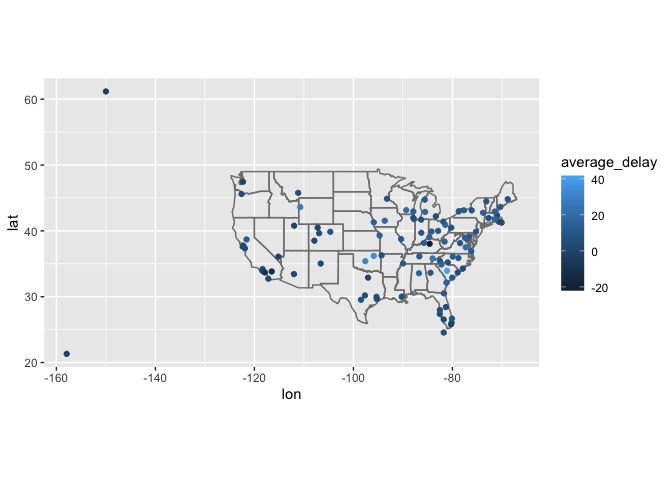
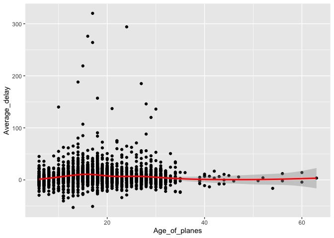

STAT 433 HW3
================
Xinyi Wang
2022-10-12

``` r
library(ggplot2)
library(tidyr)
library(nycflights13)
library(tidyverse)
```

    ## ─ Attaching packages ──────────────────── tidyverse 1.3.1 ─

    ## ✓ tibble  3.1.4     ✓ dplyr   1.0.7
    ## ✓ readr   2.1.1     ✓ stringr 1.4.0
    ## ✓ purrr   0.3.4     ✓ forcats 0.5.1

    ## ─ Conflicts ───────────────────── tidyverse_conflicts() ─
    ## x dplyr::filter() masks stats::filter()
    ## x dplyr::lag()    masks stats::lag()

``` r
library(dplyr)
```

1.  Compute the **average delay by destination**, then **join on the
    airports data** frame so you can show the spatial distribution of
    delays. You might want to use the size or color of the points to
    display the average delay for each airport.

``` r
flights %>%
    group_by(dest) %>%
    summarise(average_delay = mean(arr_delay, na.rm = TRUE)) %>%
    inner_join(airports, by = c(dest = "faa")) %>%
    ggplot(mapping = aes(lon, 
                         lat, 
                         color = average_delay)) +
    borders("state") +
    geom_point() +
    coord_quickmap()
```

<!-- -->

2.  Add the location of the **origin and destination (i.e. the lat and
    lon)** to flights.

``` r
a <- flights %>% inner_join(airports, by= c("dest" = "faa")) 
b <- a %>%  select("dest", "lon", "lat") %>% unique()
names(b) <- c("origin", "origin_lon", "origin_lat")
a %>% full_join(b, by = c("origin")) %>% rename("dest_lat" = "lat", "dest_lon" = "lon")
```

    ## # A tibble: 329,274 × 28
    ##     year month   day dep_time sched_dep_time dep_delay arr_time sched_arr_time
    ##    <int> <int> <int>    <int>          <int>     <dbl>    <int>          <int>
    ##  1  2013     1     1      517            515         2      830            819
    ##  2  2013     1     1      533            529         4      850            830
    ##  3  2013     1     1      542            540         2      923            850
    ##  4  2013     1     1      554            600        -6      812            837
    ##  5  2013     1     1      554            558        -4      740            728
    ##  6  2013     1     1      555            600        -5      913            854
    ##  7  2013     1     1      557            600        -3      709            723
    ##  8  2013     1     1      557            600        -3      838            846
    ##  9  2013     1     1      558            600        -2      753            745
    ## 10  2013     1     1      558            600        -2      849            851
    ## # … with 329,264 more rows, and 20 more variables: arr_delay <dbl>,
    ## #   carrier <chr>, flight <int>, tailnum <chr>, origin <chr>, dest <chr>,
    ## #   air_time <dbl>, distance <dbl>, hour <dbl>, minute <dbl>, time_hour <dttm>,
    ## #   name <chr>, dest_lat <dbl>, dest_lon <dbl>, alt <dbl>, tz <dbl>, dst <chr>,
    ## #   tzone <chr>, origin_lon <dbl>, origin_lat <dbl>

``` r
#In the table, the latitude and longitude of origin are named "origin_lat" and "origin_lon", and latitude and longitude of destination are named "dest_lat" and "dest_lon".
```

3.  Is there a relationship between the **age of a plane** and its
    **delays**?

``` r
age_of_planes =
  planes %>%
  mutate(age = 2019 - year) %>%
  select(tailnum,age)


flights %>%
    group_by(tailnum) %>%
    summarise(delay = mean(arr_delay, na.rm = TRUE)) %>%
    inner_join(age_of_planes, 
               by = c(tailnum = "tailnum")) %>%
    ggplot(mapping = aes(x = age, 
                         y = delay)) +
    geom_point() +
    geom_smooth(color = "red") + 
    xlab("Age_of_planes") + 
    ylab("Average_delay")
```

    ## `geom_smooth()` using method = 'gam' and formula 'y ~ s(x, bs = "cs")'

    ## Warning: Removed 76 rows containing non-finite values (stat_smooth).

    ## Warning: Removed 76 rows containing missing values (geom_point).

<!-- -->

**There is no relationship between the age of planes and their average
delays since the red line is quite flat and shows no obvious pattern.**
